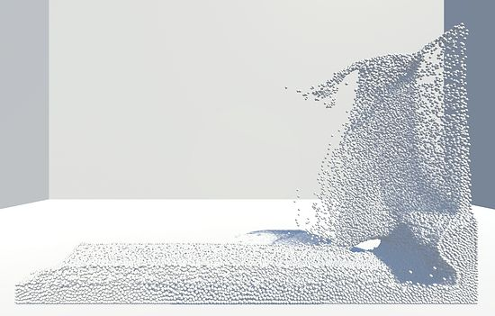
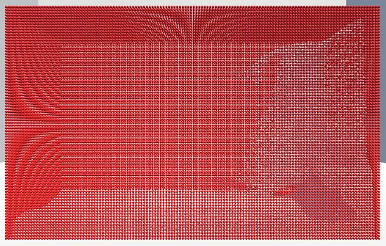
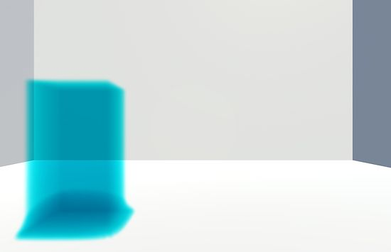
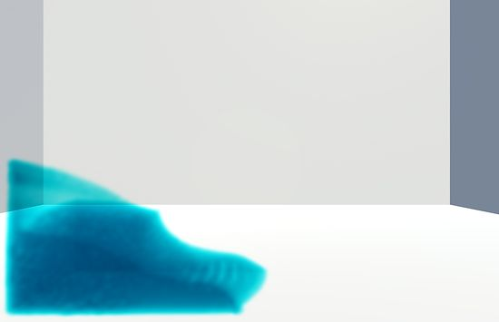
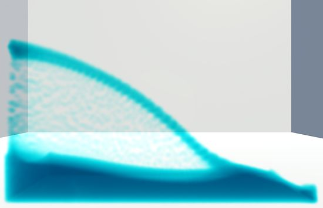
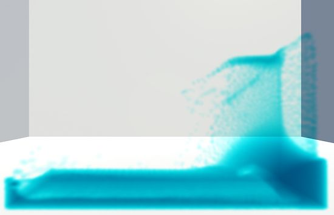

This is a position based dynamics particle fluid simulation running in Unity on the GPU. It uses the same math from the previous [PBD project](https://github.com/Scrawk/Position-Based-Dynamics) but adapted some what to run on the GPU.

The biggest difference is how finding the neighbouring particles is handled. This is more complicated on the GPU and I went with a grid hash using a Bitonic sort. Other sorting method are around (like Radix sort) and maybe faster but the Bitonic sort was simpler and works quite well. Profiling shows its not the bottle neck so a faster sort may not see much performance gain.

Its certainly not the fastest particle fluid around but can simulate 70K fluid particles and 30K boundary particles at 30fps on a GTX980 which is not too bad.

 
The boundary conditions are handled by special particles that the fluid wont flow through. These are then added around the border. This does make it more costly than other methods but it also allows objects in the scene to interact with the fluid more easily. All you need is a method to [voxlize a mesh](https://github.com/Scrawk/Mesh-Voxelization) to particles and you can then add them to the boundary.

  
To render the fluid I made a compute shader that fills a 3D texture with the particles densities. That volume can then be ray traced in a shader to render the fluid. Its just a unlit shader however so has no lighting. A method needs to be added to create normals from the volume to add lighting.

You need to use linear light space for the fluid to look like these images.

List of water projects.

[Ceto](https://github.com/Scrawk/Ceto)\
[Phillips ocean.](https://github.com/Scrawk/Phillips-Ocean)\
[Brunetons Ocean.](https://github.com/Scrawk/Brunetons-Ocean)\
[Tiled-directional flow.](https://github.com/Scrawk/Tiled-Directional-Flow)\
[PBD Fluid sim.](https://github.com/Scrawk/PBD-Fluid-in-Unity)

List of physics projects

[Position-Based-Dynamics](https://github.com/Scrawk/Position-Based-Dynamics)\
[PBD-Fluid-in-Unity](https://github.com/Scrawk/PBD-Fluid-in-Unity)\
[GPU-GEMS-NBody-Simulation](https://github.com/Scrawk/GPU-GEMS-NBody-Simulation)\
[GPU-GEMS-2D-Fluid-Simulation](https://github.com/Scrawk/GPU-GEMS-2D-Fluid-Simulation)\
[GPU-GEMS-3D-Fluid-Simulation](https://github.com/Scrawk/GPU-GEMS-3D-Fluid-Simulation)\
[CyclonePhysicsEngine](https://github.com/Scrawk/CyclonePhysicsEngine)\
[2D-Deformable-body-in-Unity](https://github.com/Scrawk/2D-Deformable-body-in-Unity)
